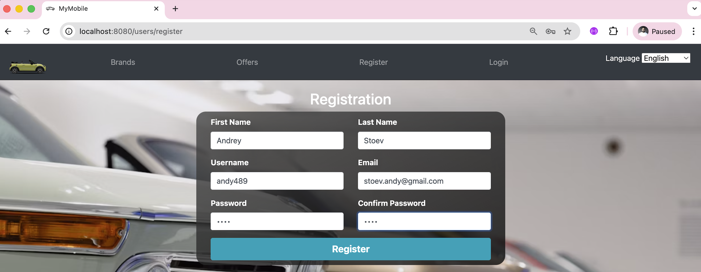
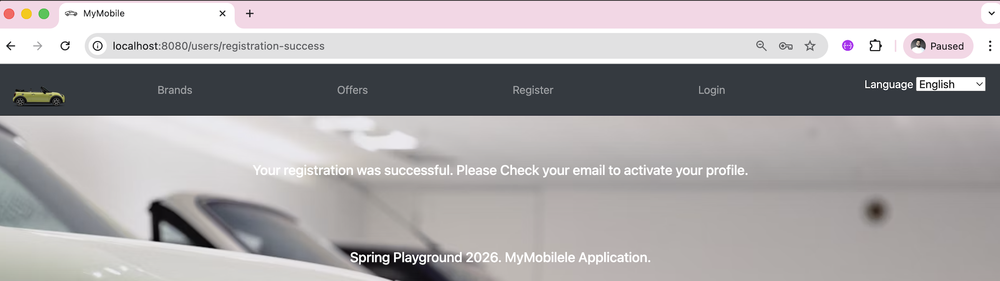
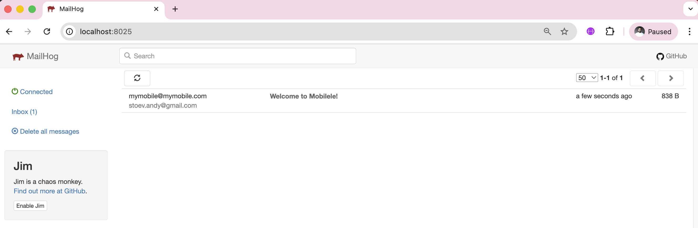
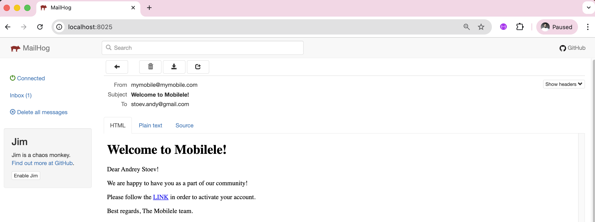
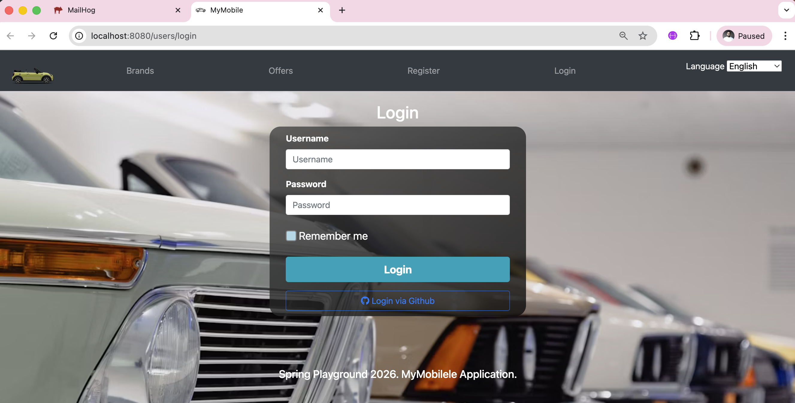
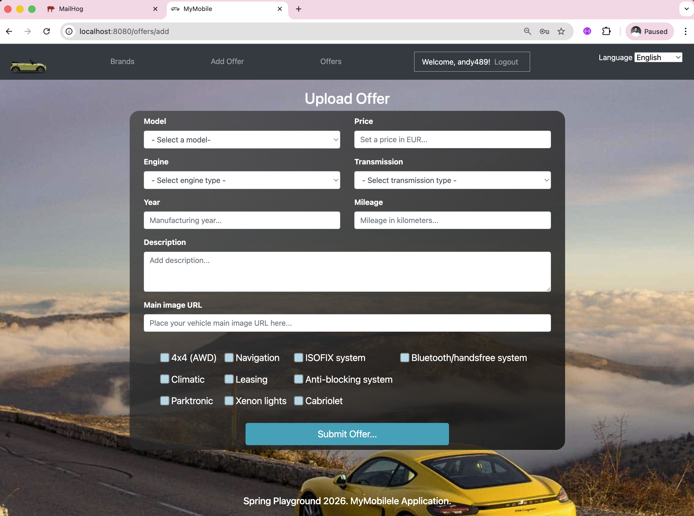
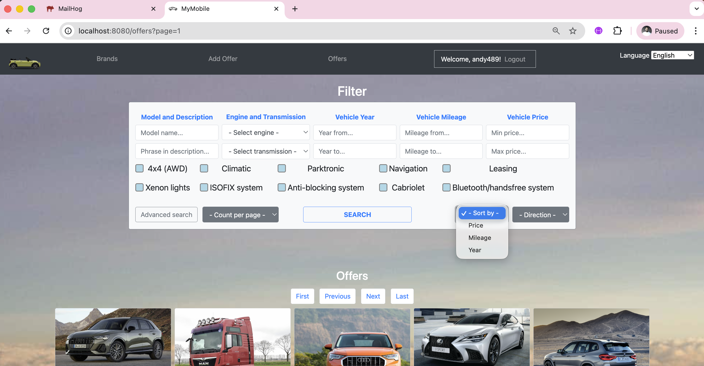
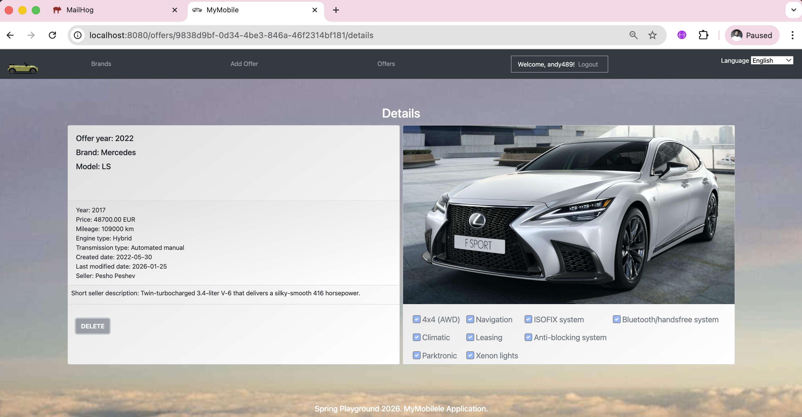

# Mobilele

## Project Setup Guide

This guide will help you set up and run the MyMobile project locally.

## Prerequisites

Make sure you have the following installed:

- Git
- Docker Desktop (with Docker Compose)
- Java JDK (version 17 or higher recommended)
- Gradle (can also use Gradle wrapper included in project)

## 1. Clone the Repository

`git clone https://github.com/andy489/MyMobile.git`

## 2. Navigate to Project Directory

`cd MyMobile`

## 3. Configure Environment Variables

The variables are stored in an .env file located inside the config folder, at the same level as the src folder.

```env
OAUTH2_GITHUB_CLIENT_ID=****DnAEY
OAUTH2_GITHUB_SECRET=****32f6
MYSQL_USER=root
MYSQL_PASS=
MYSQL_HOST=localhost
REMEMBER_ME_KEY=topsecret
MAIL_HOG_USER=mymobile@mymobile.com
MAIL_HOG_PASS=1234
OPEN_EXCHANGE_APP_ID=123
RECAPTCHA_SITE_KEY=****EMc9bM
RECAPTCHA_SITE_SECRET=****5664m
```

## 4. Start Docker Services

`docker-compose up -d`
This command will start all required services (database, mailhog) in the background.

## 5. Verify Database is Running

`docker-compose ps`

## 6. Run the Application

`./gradlew bootRun`

## Database Connection Details

Your application and database tools (like Sequel Ace) can connect using:

- Host: `127.0.0.1` or `localhost`
- Port: `3306`
- Username: `root`
- Password:
- Database: `mymobile`

## Managing Services

- Stop everything: `docker-compose down`
- View `database` logs: `docker-compose logs mysql`
- View `mailhog` logs: `docker-compose logs mailhog`

## Home Page

<div style="text-align: center; width: 720px;">
  
</div>
<br>
<div style="text-align: center; width: 720px;">
  
</div>
<br>
<div style="text-align: center; width: 720px;">
  
</div>

## Activate Registration (MailHog)

<div style="text-align: center; width: 720px;">
  
</div>
<br>
<div style="text-align: center; width: 720px;">
  
</div>
<br>
<div style="text-align: center; width: 720px;">
  
</div>

## Login

<div style="text-align: center; width: 720px;">
  
</div>

## Upload an Offer

<div style="text-align: center; width: 720px;">
  
</div>

## Light Search

<div style="text-align: center; width: 720px;">
  
</div>

## Advanced Search (Criteria API: Sorting and Pagination, Filtering by Criteria)

<div style="text-align: center; width: 720px;">
  
</div>

## Offer Details

Delete button is active only when user is admin (username: `admin`, password: `1234`)

<div style="text-align: center; width: 720px;">
  
</div>

All user roles can be verified within the SQL files processed by Flyway, located in the `resources` directory:

- resources/db.migration
    - V1_0_0_00__create_tables.sql
    - V1_0_0_01__init_user_roles.sql
    - V1_0_0_02__init_data.sql

The project also features comprehensive internationalization (i18n) across all pages and text fields, as well as for all
system-generated files—such as emails sent for registration activation and similar communications.